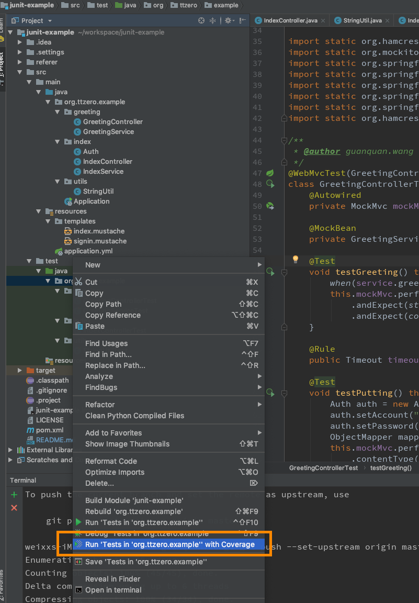
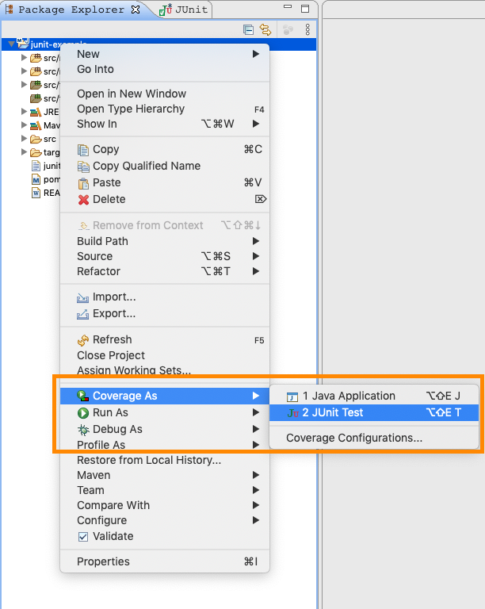

# JUnit

JUnit是一个Java语言的单元测试框架。它由肯特·贝克和埃里希·伽玛（Erich Gamma）建立，逐渐成为源于Kent Beck的sUnit的xUnit家族中为最成功的一个。

对于单元测试框架来讲，它主要完成以下几件事。

- **提供用例组织与执行**： 当你的测试用例只有几条时，可以不必考虑用例的组织，但是，当测试用例达到成百上千条时，大量的测试用例堆砌在一起，就产生了扩展性与维护性等问题，需要考虑用例的规范与组织 问题了。单元测试框架就是用来解决这个问题的。。
- **提供丰富的断言方法**： 不论是功能测试，还是单元测试，在用例执行完成之后都需要将实际结果与进行预期结果的进行比较（断言），从而断定用例是否执行通过。单元测试框架一般会提供丰富的断言方法。例如，判断相等/不等、包含/不包含、True/False的断言方法等。
- **提供丰富的日志**： 当测试用例执行失败时能抛出清晰的失败原因，当所有用例执行完成后能提供丰富的执行结果。例如，总执行时间、失败用例数、成功用例数等。

从这些特性来看单元测试框架的作用是：帮助我们更自动化测试完成测试，所以，它是自动化测试的基础。

### 几个重要注解

JUnit 5 |	JUnit 4	| 说明
--------|---------|------
@Test |	@Test	| 被注解的方法是一个测试方法。与 JUnit 4 相同。
@BeforeAll |@BeforeClass|	被注解的（静态）方法将在当前类中的所有 @Test 方法前执行一次。
@BeforeEach	|@Before|	被注解的方法将在当前类中的每个 @Test 方法前执行。
@AfterEach	|@After|	被注解的方法将在当前类中的每个 @Test 方法后执行。
@AfterAll	|@AfterClass|	被注解的（静态）方法将在当前类中的所有 @Test 方法后执行一次。
@Disabled	|@Ignore|	被注解的方法不会执行（将被跳过），但会报告为已执行。

其中@Test注解可以指定有expected和timeout两个参数，前者用于异常类抓取后者可以判断用例运行时间是否达标。

@FixMethodOrder用于控制用例的执行顺序，对于某些情况此注解是必须的(比如测试查询的时候必须先测试新增方法)。它有三个值
- MethodSorters.JVM 按照JVM得到的方法顺序，也就是代码中定义的方法顺序
- MethodSorters.DEFAULT(默认的顺序)
- MethodSorters.NAME_ASCENDING 按方法名字母顺序执行

### JUnit 断言方法

断言 (assertion) 是 org.junit.jupiter.api.Assertions 类上的众多静态方法之一。断言用于测试一个条件，该条件必须计算为 true，测试才能继续执行。

如果断言失败，测试会在断言所在的代码行上停止，并生成断言失败报告。如果断言成功，测试会继续执行下一行代码。

常用断言

方法	|说明
----|-------
assertArrayEquals(expecteds, actuals)	|查看两个数组是否相等。
assertEquals(expected, actual)	|查看两个对象是否相等。类似于字符串比较使用的equals()方法。
assertNotEquals(first, second)	|查看两个对象是否不相等。
assertNull(object)	|查看对象是否为空。
assertNotNull(object)|	查看对象是否不为空。
assertSame(expected, actual)	|查看两个对象的引用是否相等。类似于使用“==”比较两个对象。
assertNotSame(unexpected, actual)	|查看两个对象的引用是否不相等。类似于使用“!=”比较两个对象。
assertTrue(condition)	|查看运行结果是否为true。
assertFalse(condition)	|查看运行结果是否为false。
assertThat(actual, matcher)	|查看实际值是否满足指定的条件。
fail()	|让测试失败。

### 覆盖率

跑覆盖率我们需要借助IDE工具，下面介绍开发java最常用的IDE工具IDEA和eclipse上跑覆盖率的方法。

#### IDEA
右击项目选择"Run 'All Tests' with Coverage"

#### Eclipse
右击项目选择"Coverage As" -> "Junit Test"

## 参考文档
[JUnit 5 User Guide](https://junit.org/junit5/docs/current/user-guide/)
[JUnit 5 Jupiter API](https://www.ibm.com/developerworks/cn/java/j-introducing-junit5-part1-jupiter-api/index.html)